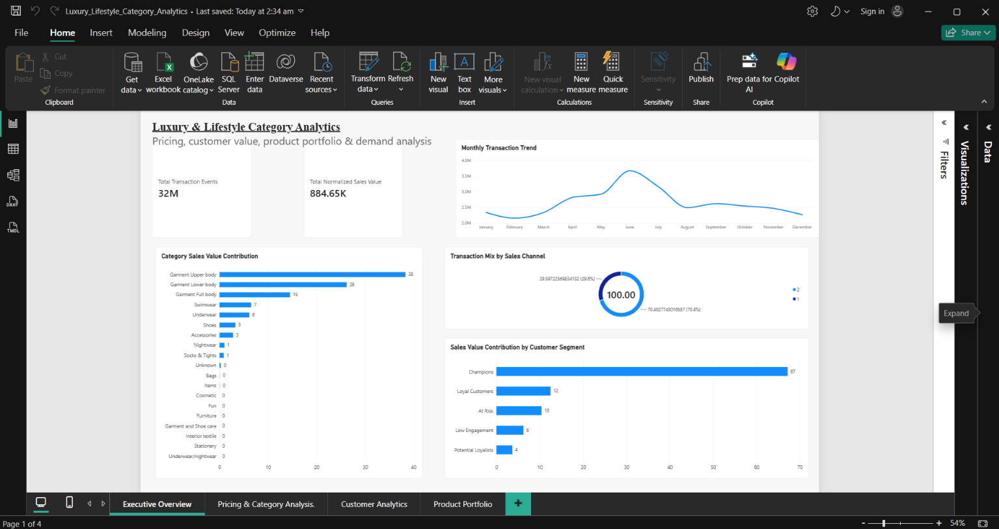
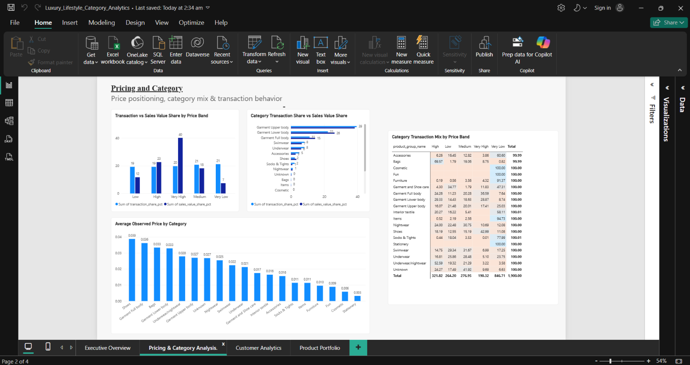
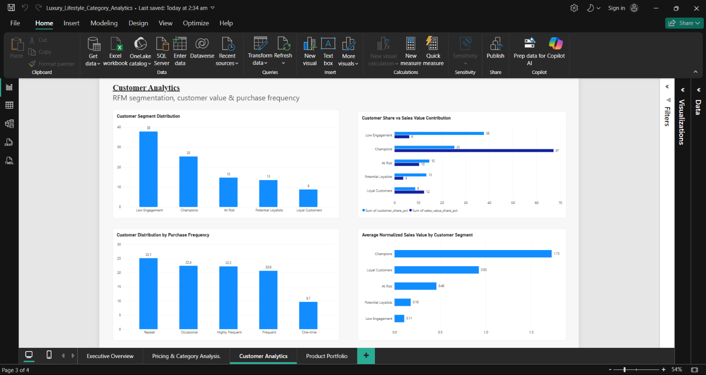
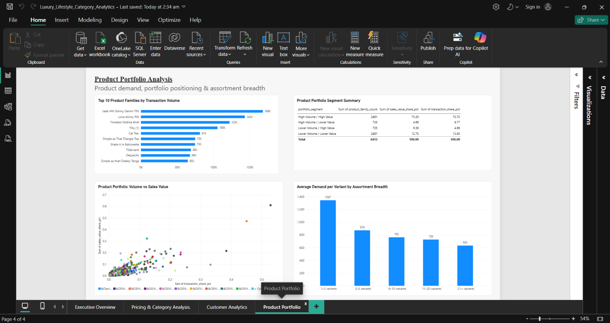

# 🛍️ Luxury & Lifestyle Category Analytics

**E-commerce Category Analytics | Pricing • Customer Value • Product Portfolio • Seasonality**

An end-to-end analytics project analyzing **31.79M+ e-commerce transaction events** from the H&M Personalized Fashion Recommendations dataset to understand category demand, observed pricing, customer value, product portfolio performance, assortment breadth, seasonality, and sales-channel behavior.

The project approaches the data from a **category-management and business decision-making perspective**, combining Python, SQL, Excel, and Power BI.

---

## 📊 Power BI Dashboard

### Executive Overview



### Pricing & Category



### Customer Analytics



### Product Portfolio



---

## 🎯 Business Objective

The project investigates questions such as:

* Which categories contribute most to transaction volume and normalized sales value?
* How does observed price positioning relate to transaction activity?
* Which customer segments contribute the most normalized sales value?
* Which product families generate the highest transaction demand?
* How does assortment breadth relate to average demand per variant?
* Which calendar months show higher historical transaction activity?
* How does transaction and normalized sales-value contribution differ across sales channels?

---

## 📦 Dataset

The primary dataset is the **H&M Personalized Fashion Recommendations** dataset.

It contains:

* Customer information
* Product/article information
* Transaction events
* Product categories and departments
* Normalized transaction prices
* Sales-channel identifiers

### Dataset Scale

| Dataset Component  |       Scale |
| ------------------ | ----------: |
| Transaction events | **31.79M+** |
| Customers          |  **1.37M+** |
| Articles           |   **105K+** |
| Purchased articles |   **104K+** |

> The large raw transaction dataset is intentionally excluded from this repository because of its size. The repository contains processed analytical outputs and a smaller sample where applicable.

---

## 🛠️ Tools & Technologies

| Area                 | Tools                 |
| -------------------- | --------------------- |
| Data Analysis        | Python, Pandas, NumPy |
| Visualization        | Matplotlib, Seaborn   |
| Querying             | SQL, DuckDB           |
| Spreadsheet Analysis | Excel                 |
| Dashboarding         | Power BI              |
| Version Control      | Git, GitHub           |

---

## 🔍 Analysis Modules

### 1. Category & Pricing Analysis

Analyzed:

* Transaction volume by product category
* Normalized sales-value contribution
* Observed price distribution
* Price bands
* Category × price-band behavior
* Transaction-share vs sales-value-share differences

### 2. Customer RFM Segmentation

Built customer-level RFM analysis using:

* **Recency**
* **Frequency**
* **Monetary value**

Customer groups include:

* Champions
* Loyal Customers
* At Risk
* Potential Loyalists
* Low Engagement

RFM scores are **relative quintile-based segments**, rather than absolute customer-value thresholds.

### 3. Product Portfolio Analysis

Analyzed:

* Product-family transaction demand
* Product-family normalized sales value
* Variant breadth
* High/low volume and value positioning
* Demand contribution across the portfolio

### 4. Assortment Breadth

Investigated the relationship between the number of variants within a product family and average transaction demand per variant.

### 5. Seasonality Analysis

Analyzed recurring calendar-month transaction patterns across the available transaction history.

The analysis accounts for partial months at the beginning and end of the dataset.

### 6. Sales Channel Analysis

Compared:

* Transaction volume
* Transaction share
* Normalized sales-value contribution
* Average observed transaction price

across the dataset's two sales-channel identifiers.

---

## 🧠 Technical Approach

### Data Processing

The transaction dataset contains more than 31 million rows, so the analysis was designed to avoid loading the entire dataset into memory at once.

Python **Pandas chunk processing** was used to generate reusable analytical datasets for:

* Monthly transaction trends
* Customer RFM segments
* Purchase frequency
* Price bands
* Category pricing
* Category × price-band analysis
* Product-family demand
* Product portfolio classification
* Assortment breadth
* Sales-channel contribution

### SQL Analysis

SQL analysis was performed using **DuckDB** to reproduce and structure key business analyses, including:

* Category analysis
* Customer frequency analysis
* Pricing analysis
* Product portfolio analysis
* Seasonality analysis

### Excel

Excel was used to create structured analytical tables and supporting visualizations for:

* Category performance
* Pricing
* Customer segments
* Product portfolio
* Seasonality

### Power BI

The final dashboard contains four pages:

**01 — Executive Overview**

Overall transaction scale, category contribution, sales-channel mix, customer-segment value contribution, and monthly trends.

**02 — Pricing & Category**

Price-band behavior, category pricing, and transaction-share vs normalized sales-value-share analysis.

**03 — Customer Analytics**

RFM segmentation, customer contribution, purchase frequency, and customer-value comparisons.

**04 — Product Portfolio**

Product-family demand, portfolio positioning, and assortment-breadth analysis.

---

## 📈 Selected Findings

### Customer Value

The RFM analysis identified a **Champions** segment representing approximately **25.3% of customers but 67.2% of normalized sales value**.

This highlights a strong concentration of normalized sales value among the highest-value customer segment.

### Pricing

The **Very High** observed-price band represented approximately **19.7% of transactions but 40.1% of normalized sales value**.

This indicates that transaction volume and normalized sales-value contribution are not distributed equally across price bands.

### Product Portfolio

Product families with both high transaction volume and high normalized sales value represented approximately **73% of transaction volume and 73% of normalized sales value** among the analyzed product-family portfolio.

### Seasonality

Historical transaction activity showed stronger recurring activity around **May–July**, with June having the highest seasonality index in the analyzed recurring-month comparison.

### Assortment Breadth

The analysis observed lower average transaction demand per variant among product families with broader variant counts. This is a **descriptive association**, not evidence that increasing assortment breadth causes lower demand.

---

## 💡 Business Applications

The analysis can support category-management decisions such as:

* Identifying categories with strong transaction and value contribution
* Monitoring price-band performance
* Prioritizing high-value customer segments for retention initiatives
* Identifying high-demand product families
* Evaluating assortment breadth
* Planning around recurring seasonal demand patterns
* Comparing sales-channel behavior

These are **analytical recommendations based on observed historical patterns**, not causal estimates.

---

## ⚠️ Data Limitations & Assumptions

Several limitations are important when interpreting the analysis:

* The transaction `price` is a **normalized value**, not an INR price.
* The dataset does not provide actual product cost, so actual profit margin cannot be calculated.
* Transaction rows do not represent confirmed unique orders or quantities.
* Sales-channel IDs are retained as **Channel 1** and **Channel 2** rather than being labeled online/offline.
* RFM segments use relative quintile scoring.
* September has limited complete-year coverage in the available data.
* Product portfolio classifications use median-based thresholds.
* Associations identified in the analysis should not be interpreted as causal relationships.
* The project uses historical transaction data and therefore describes past behavior rather than guaranteeing future outcomes.

---

## 📁 Project Structure

```text
Luxury_Lifestyle_Category_Analytics/
│
├── data/
│   ├── raw/
│   ├── interim/
│   └── processed/
│
├── excel/
│   └── Luxury_Lifestyle_Category_Analytics.xlsx
│
├── notebook/
│   └── 01_data_understanding.ipynb
│
├── powerbi/
│   ├── Luxury_Lifestyle_Category_Analytics.pbix
│   └── data/
│
├── reports/
│   └── business_insights.md
│
├── screenshots/
│   ├── 01_Executive_Overview.png
│   ├── 02_Pricing_and_Category.png
│   ├── 03_Customer_Analytics.png
│   └── 04_Product_Portfolio.png
│
├── sql/
│   ├── 01_category_analysis.sql
│   ├── 02_customer_analysis.sql
│   ├── 03_pricing_analysis.sql
│   ├── 04_product_portfolio_analysis.sql
│   └── 05_seasonality_analysis.sql
│
├── .gitignore
└── README.md
```

---

## 🚀 Reproducibility

The repository contains the analytical code, SQL queries, processed datasets, Excel workbook, Power BI report, and dashboard screenshots used in the project.

The original large H&M transaction dataset is not included because of its file size.

---

## 👩‍💻 Project Focus

**Category Analytics • Customer Analytics • Pricing Analytics • Product Portfolio • Business Intelligence**

Built as an end-to-end portfolio project demonstrating the use of **Python, SQL, Excel, and Power BI** to translate large-scale e-commerce transaction data into business-oriented insights.
git add README.md
git status